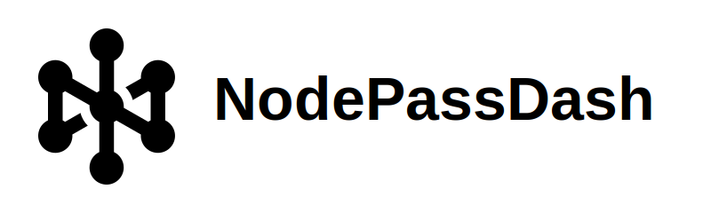

<div align="center">
  
</div>


NodePassDash是一个现代化的 NodePass 管理界面，基于 Go 后端 + React + Vite、HeroUI 和 TypeScript 构建。提供实时隧道监控、流量统计和端点管理功能。

> **⚠️ 重大版本升级通知**  
> **version 2.x 是一个重大的架构迁移版本！** 从 Node.js 后端完全重构为 Go 后端，带来了更高的性能和稳定性。 
> 
> ***升级前请务必备份好你的数据！*** 新版本支持数据迁移，但建议在安全的环境中先进行测试。

## ✨ 主要特性

- 🚀 **高性能 Go 后端**: 完全重构的 Go 后端，性能提升 300%+，内存占用降低 60%
- 🎯 **实时监控**: 通过 Server-Sent Events (SSE) 实现实时隧道状态更新
- 📊 **流量统计**: 可视化显示隧道流量数据和性能指标
- 🎨 **现代UI**: 基于 HeroUI 的响应式设计，支持深色/浅色主题
- 📱 **移动适配**: 完整的移动端响应式布局，支持各种设备访问
- 🐳 **容器化**: 开箱即用的 Docker 部署方案
- 🔧 **命令行工具**: 支持密码重置和自定义端口等管理功能

## 📸 界面预览

| | | |
|---|---|---|
|  |  |  |
|  |  |  |

## 📂 目录结构（简化）
```text
├─ web/                 前端应用 (React + Vite + HeroUI)
│  ├─ src/              React 组件和页面
│  ├─ public/           静态资源 (logo, favicon 等)
│  └─ package.json      前端依赖和构建脚本
├─ internal/            Go 业务代码
├─ cmd/server/          Go 应用入口
├─ Dockerfile           多阶段容器构建
├─ build.sh             本地构建脚本
└─ .github/workflows/   CI/CD 自动化构建
```

## ⚡️ 快速开始

<div style="display: flex; align-items: center; gap: 12px;">
  <a href="https://dash.nodepass.eu/">
    
  </a>
  <span><strong>演示账号：</strong> <code>nodepass</code> / <code>Np123456</code></span>
</div>

> ⚠️ **重要提醒：演示环境，请勿更改密码，请勿填写任何敏感信息**

我们提供三种部署方式，请根据你的需求选择：

### 🐳 方式一：Docker 部署（推荐）

> 适合生产环境，开箱即用，自动处理依赖和环境配置。

📚 查看 [Docker 完整部署文档](docs/DOCKER.md) 了解详细配置

### 📦 方式二：二进制部署

> 适合 VPS/服务器环境，性能最优，支持 systemd 服务管理。

📚 查看 [二进制部署文档](docs/BINARY.md) 了解详细配置

### 🛠️ 方式三：开发环境

> 适合开发者本地开发和调试。

📚 查看 [开发环境文档](docs/DEVELOPMENT.md) 了解完整开发流程

## 🔧 命令行工具

NodePassDash v2.0.0 提供了命令行参数来管理和配置应用：

### 基本参数

```bash
# 指定端口启动（默认 3000）
./nodepassdash --port 8080
# 配置证书以启动https访问
./nodepassdash --cert /path/to/cert.pem --key /path/to/cert.key
# 启动时指定日志等级
./nodepassdash --log-level debug
# 显示帮助信息
./nodepassdash --help
# 显示版本信息
./nodepassdash --version
# 禁用用户名密码登录
./nodepassdash --disable-login
```

### 管理工具

```bash
# 重置管理员密码，注：重置后需要重启服务
./nodepassdash --resetpwd
# 系统会提示输入新的用户名和密码
# 数据库维护（检查和修复）
./nodepassdash --db-check
# 清理日志文件（保留最近30天）
./nodepassdash --clean-logs
```

### Docker 环境下使用

```bash
# 在运行中的容器内重置密码，注：重置后需要重启容器
docker exec -it nodepassdash ./nodepassdash --resetpwd

# 使用自定义端口启动容器
docker run -d \
  --name nodepassdash \
  -p 8080:8080 \
  ghcr.io/nodepassproject/nodepassdash:latest \
  ./nodepassdash --port 8080
```

## 📄 许可证

本项目基于 [BSD-3-Clause 许可证](LICENSE) 开源。

## ⚖️ 免责声明

本项目以“现状”提供，开发者不提供任何明示或暗示的保证。用户使用风险自担，需遵守当地法律法规，仅限合法用途。开发者对任何直接、间接、偶然或后果性损害概不负责。进行二次开发须承诺合法使用并自负法律责任。开发者保留随时修改软件功能及本声明的权利。最终解释权归开发者所有。

## 📞 支持

- 🐛 问题报告: [GitHub Issues](https://github.com/NodePassProject/NodePassDash/issues)
- 💬 社区讨论: [Telegram 群组](https://t.me/NodePassGroup)
- 📢 频道: [Telegram 频道](https://t.me/NodePassChannel)

---

⭐ 如果这个项目对你有帮助，请给我们一个 Star！

[](https://star-history.com/#NodePassProject/NodePassDash&Date)

