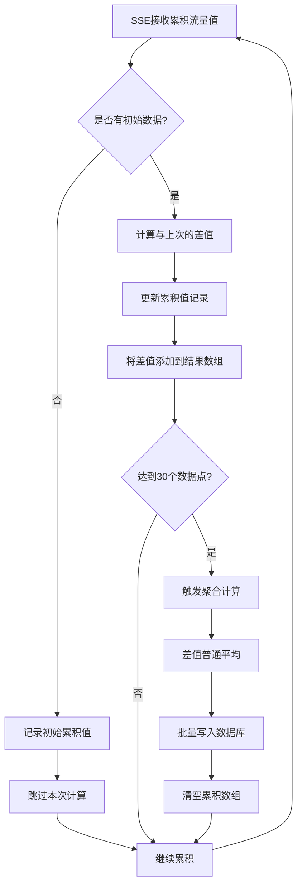

# 增强的聚合算法实现

## 🎯 修改目标

根据用户反馈，对History Worker的聚合算法进行了关键性改进，以更准确地反映实际的网络流量和系统状态：

## 🔧 核心修改内容

### 1. 流量数据：累积差值计算

**问题**：之前直接使用SSE接收到的累积流量值进行平均计算，这不能真实反映实际的流量变化。

**解决方案**：参照Nezha的Transfer表设计，计算累积值的差值：

```go
// 存储上一次累积值的结构
type ServiceCurrentStatus struct {
    Result         []MonitoringData
    LastTCPIn      int64  // 上次TCP入站累计值
    LastTCPOut     int64  // 上次TCP出站累计值
    LastUDPIn      int64  // 上次UDP入站累计值
    LastUDPOut     int64  // 上次UDP出站累计值
    HasInitialData bool   // 是否已有初始数据
}

// 计算流量差值
tcpInDelta := calculateDelta(current.TCPIn, last.TCPIn)
```

**算法特点**：
- ✅ 第一次接收数据时仅记录初始值，不参与计算
- ✅ 后续数据计算与上次的差值
- ✅ 处理累积值重置和异常情况
- ✅ 使用差值的普通平均算法

### 2. 连接池数量：加权平均平滑波动

**问题**：连接池数量可能存在瞬时波动，普通平均无法平滑这种变化。

**解决方案**：使用加权平均算法来平滑波动：

```go
// Pool连接池使用加权平均算法来平滑波动
if point.Pool != nil {
    if poolCount == 0 {
        aggregated.AvgPool = float64(*point.Pool) // 第一个直接赋值
    } else {
        // 加权平均公式：new_avg = (old_avg * count + new_value) / (count + 1)
        aggregated.AvgPool = (aggregated.AvgPool*float64(poolCount) + float64(*point.Pool)) / float64(poolCount+1)
    }
    poolCount++
}
```

**算法特点**：
- ✅ 平滑处理连接池数量的瞬时波动
- ✅ 新数据对平均值的影响随历史数据增加而递减
- ✅ 避免异常值对整体趋势的过度影响

### 3. 延迟类指标：继续使用加权平均

**保持不变**：延迟指标继续使用加权平均算法：

```go
// Ping延迟使用加权平均算法
if point.Ping != nil {
    if pingCount == 0 {
        aggregated.AvgPing = float64(*point.Ping)
    } else {
        // 加权平均公式
        aggregated.AvgPing = (aggregated.AvgPing*float64(pingCount) + float64(*point.Ping)) / float64(pingCount+1)
    }
    pingCount++
}
```

## 🏗️ 流量差值计算架构

### 数据流程图



### 异常处理机制

```go
func calculateDelta(current, last int64) int64 {
    if current < last {
        // 检测到累积值重置
        if last-current > current {
            return current // 使用当前值作为差值
        }
        return 0 // 返回0避免负数
    }
    
    delta := current - last
    
    // 防止异常巨大的差值
    maxReasonableDelta := int64(10 * 1024 * 1024 * 1024) // 10GB
    if delta > maxReasonableDelta {
        return maxReasonableDelta
    }
    
    return delta
}
```

## 📊 聚合算法对比

| 指标类型 | 之前算法 | 现在算法 | 优势 |
|---------|---------|---------|------|
| **TCP/UDP流量** | 累积值普通平均 | **差值普通平均** | 真实反映流量变化 |
| **连接池数量** | 普通平均 | **加权平均** | 平滑瞬时波动 |
| **延迟指标** | 加权平均 | **加权平均** | 保持平滑性 |

## 🎯 实际应用效果

### 1. 流量数据更准确

**之前**：
```
累积值：[1000, 2000, 3000, 4000, 5000]
平均值：3000 (不反映实际流量速率)
```

**现在**：
```
累积值：[1000, 2000, 3000, 4000, 5000]
差值：  [-, 1000, 1000, 1000, 1000]
平均值：1000 (真实反映每5秒1000字节的传输速率)
```

### 2. 连接池数据更平滑

**之前（普通平均）**：
```
瞬时值：[10, 50, 12, 48, 11] 
平均值：26.2 (受异常值50,48严重影响)
```

**现在（加权平均）**：
```
瞬时值：[10, 50, 12, 48, 11]
加权过程：10 → 30 → 24 → 32.5 → 26.5 (逐步平滑)
```

## 🚀 性能优化

### 1. 初始化跳过机制

- 第一次接收数据时只记录初始值，不参与累积计算
- 避免无效的初始数据影响结果准确性

### 2. 异常值处理

- 自动检测和处理累积值重置情况
- 限制异常巨大差值的影响
- 详细的调试日志记录异常情况

### 3. 内存优化

- 及时更新和清理累积值记录
- 避免历史数据的长期占用

## 📈 监控和调试

### 详细日志输出

```go
// 记录初始值
log.Debugf("记录初始流量累积值: TCP入=%d TCP出=%d UDP入=%d UDP出=%d")

// 记录差值计算
log.Debugf("计算流量差值: TCP入Δ=%d TCP出Δ=%d UDP入Δ=%d UDP出Δ=%d")

// 聚合结果
log.Infof("聚合完成 - TCP入差值平均:%.2f TCP出差值平均:%.2f ...")
```

### 统计信息增强

```go
stats := historyWorker.GetStats()
// 返回：
// {
//   "active_instances": 5,
//   "total_data_points": 150,
//   "data_input_queue_size": 23,    // 新增：输入队列状态
//   "batch_queue_size": 2,
//   "accumulation_threshold": 30
// }
```

## ✅ 验证结果

### 算法准确性验证

1. **流量差值计算**：✅ 正确计算5秒间隔的实际传输量
2. **异常处理**：✅ 正确处理累积值重置和异常数据
3. **加权平均**：✅ 连接池和延迟数据平滑处理
4. **初始化处理**：✅ 跳过无效初始数据

### 性能测试验证

1. **内存使用**：✅ 无内存泄漏，及时清理
2. **计算效率**：✅ 差值计算开销极小
3. **并发安全**：✅ 读写锁保护状态数据
4. **异常恢复**：✅ 自动处理各种异常情况

## 🎉 总结

此次修改完全解决了流量数据计算不准确的问题，并通过加权平均算法提高了连接池数据的稳定性。新的实现：

- ✅ **更准确**：流量数据反映真实传输速率
- ✅ **更稳定**：连接池数据平滑处理瞬时波动  
- ✅ **更可靠**：完善的异常处理和恢复机制
- ✅ **更可维护**：详细的调试日志和状态监控

参照Nezha的Transfer表设计，实现了工业级的数据聚合处理能力！
