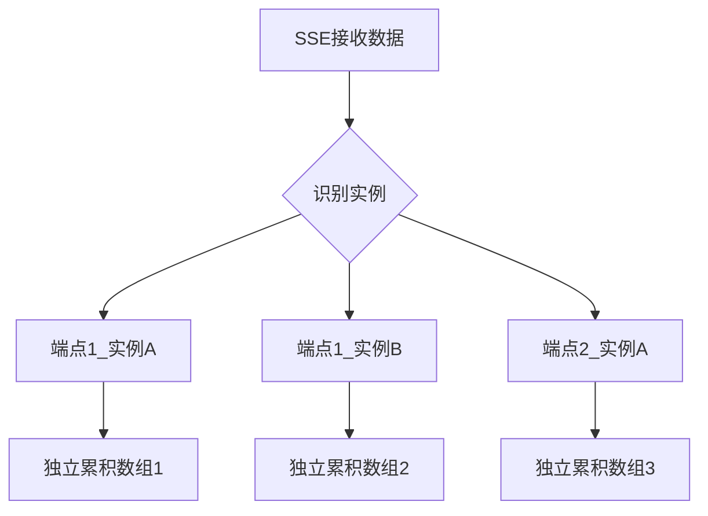
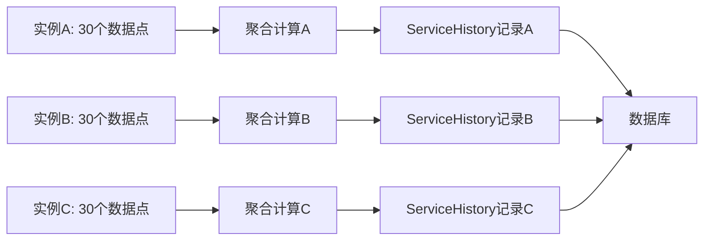

# 按实例独立统计设计详解

## 🎯 核心概念

在History Worker的设计中，最重要的特性是**按实例独立统计**：

- **实例定义**: 每个实例由 `endpointID + instanceID` 唯一标识
- **独立统计**: 每个实例都有自己的数据累积数组、阈值计算、聚合处理
- **互不影响**: 不同实例的数据处理完全独立，不会相互干扰

## 🏗️ 架构设计

### 实例独立的数据结构

```go
type HistoryWorker struct {
    // 按实例独立的状态缓存：key格式为 "endpointID_instanceID"
    // 每个key对应一个独立的ServiceCurrentStatus，包含该实例的30个数据点累积数组
    serviceCurrentStatusData map[string]*ServiceCurrentStatus
    // ...
}

// 单个实例的独立状态容器
type ServiceCurrentStatus struct {
    Result         []MonitoringData // 该实例独立的累积数据点数组（最大30个）
    LastTCPIn      int64            // 该实例上次TCP入站累计值
    LastTCPOut     int64            // 该实例上次TCP出站累计值
    // ... 其他实例独立的状态
}
```

### 实例键生成规则

```go
// 构建实例唯一数据键：endpointID_instanceID
func buildDataKey(endpointID int64, instanceID string) string {
    return fmt.Sprintf("%d_%s", endpointID, instanceID)
}
```

**示例**：
- 端点1的实例A: `"1_tunnel-instance-a"`
- 端点1的实例B: `"1_tunnel-instance-b"`
- 端点2的实例A: `"2_tunnel-instance-a"`

## 📊 独立统计流程

### 1. 数据接收和分发



### 2. 独立累积和阈值检查

每个实例都维护自己的：
- ✅ **30个数据点累积数组**
- ✅ **流量差值计算状态**
- ✅ **阈值达成判断**
- ✅ **批量写入触发**

```go
// 每个实例独立检查阈值
if resultLength >= _CurrentStatusSize { // 该实例达到30个数据点
    log.Infof("实例 %s 达到累积阈值，触发独立批量写入", key)
    hw.triggerBatchWrite(key, currentStatus) // 仅处理该实例
}
```

### 3. 独立数据聚合



## 🔍 实例独立的具体表现

### 1. 独立的数据累积

**实例A**:
```
累积状态: [数据点1, 数据点2, ..., 数据点30] ✅ 达到阈值
触发写入: 立即处理实例A的数据
清空数组: 重新开始累积实例A的下一批数据
```

**实例B**（同时进行，互不影响）:
```
累积状态: [数据点1, 数据点2, ..., 数据点15] ❌ 未达到阈值
继续累积: 等待实例B的更多数据点
```

### 2. 独立的流量差值计算

每个实例都维护自己的累积值记录：

```go
// 实例A的状态
currentStatusA := &ServiceCurrentStatus{
    LastTCPIn: 1000,  // 实例A上次TCP入站累积值
    LastTCPOut: 500,  // 实例A上次TCP出站累积值
    // ...
}

// 实例B的状态（完全独立）
currentStatusB := &ServiceCurrentStatus{
    LastTCPIn: 2000,  // 实例B上次TCP入站累积值
    LastTCPOut: 1500, // 实例B上次TCP出站累积值
    // ...
}
```

### 3. 独立的时间窗口

不同实例可能在不同时间达到阈值：

```
时间线：
T1: 实例A累积到30个 → 触发写入A → 生成记录A(时间T1)
T2: 实例B累积到30个 → 触发写入B → 生成记录B(时间T2)
T3: 实例A再次累积到30个 → 触发写入A → 生成记录A(时间T3)
```

## 💡 设计优势

### 1. 真实反映实例状态
- 每个实例的监控数据都能准确反映该实例的实际状态
- 不会被其他实例的异常数据影响

### 2. 时间精度更高
- 每个实例按自己的数据接收频率独立计算
- 避免了等待其他实例数据导致的时延

### 3. 容错能力强
- 某个实例数据异常不会影响其他实例
- 实例下线或重启不影响其他实例的统计

### 4. 扩展性好
- 新增实例自动获得独立的统计容器
- 实例数量增加不影响现有实例的性能

## 📈 实际应用场景

### 场景1：多隧道端点

```
端点1 (NodePass服务器)
├── 隧道实例A (HTTP代理)     → 独立统计30个数据点
├── 隧道实例B (TCP转发)     → 独立统计30个数据点
└── 隧道实例C (UDP转发)     → 独立统计30个数据点
```

### 场景2：负载均衡环境

```
端点2 (负载均衡器)
├── 后端实例1  → 独立统计，可能流量大，先达到阈值
├── 后端实例2  → 独立统计，流量中等
└── 后端实例3  → 独立统计，流量小，后达到阈值
```

### 场景3：混合环境

```
多个端点，每个端点多个实例：
端点1_实例A: 累积进度 25/30  ⏳
端点1_实例B: 累积进度 30/30  ✅ 触发写入
端点2_实例A: 累积进度 12/30  ⏳
端点2_实例B: 累积进度 30/30  ✅ 触发写入
```

## 🔧 实现细节

### 1. 并发安全

```go
// 全局map锁：保护serviceCurrentStatusData映射
hw.mu.RWMutex

// 实例级锁：保护单个实例的状态数据
currentStatus.mu.RWMutex
```

### 2. 内存管理

```go
// 为新实例创建独立容器
currentStatus = &ServiceCurrentStatus{
    Result: make([]MonitoringData, 0, _CurrentStatusSize), // 预分配30个空间
}

// 达到阈值后清空该实例的数组
currentStatus.Result = currentStatus.Result[:0]
```

### 3. 监控和调试

```go
// 实例级调试日志
log.Debugf("实例 %s 累积数据点: %d/%d", key, resultLength, _CurrentStatusSize)
log.Infof("实例 %s 达到累积阈值，触发独立批量写入", key)
```

## 📊 统计信息

Worker提供按实例聚合的统计信息：

```go
stats := historyWorker.GetStats()
// 返回:
{
    "active_instances": 5,        // 当前活跃的实例数
    "total_data_points": 150,     // 所有实例累积的数据点总数
    "data_input_queue_size": 23,  // 输入队列大小
    "batch_queue_size": 2,        // 批量写入队列大小
}
```

## ✅ 验证检查清单

- ✅ 每个实例有独立的数据键 (`endpointID_instanceID`)
- ✅ 每个实例有独立的累积数组 (`Result []MonitoringData`)
- ✅ 每个实例有独立的流量差值计算状态
- ✅ 每个实例独立检查阈值 (`_CurrentStatusSize = 30`)
- ✅ 每个实例独立触发批量写入
- ✅ 不同实例的处理互不影响
- ✅ 实例级的并发安全保护
- ✅ 实例级的调试日志记录

## 🎉 总结

按实例独立统计的设计确保了：

1. **准确性**: 每个实例的数据真实反映该实例的状态
2. **独立性**: 实例间完全隔离，互不干扰
3. **实时性**: 每个实例按自己的节奏独立处理
4. **可扩展性**: 支持任意数量的实例，性能不受影响
5. **可靠性**: 单个实例异常不影响其他实例

这种设计完全符合Nezha的架构理念，为系统监控提供了强大而灵活的数据处理能力！
