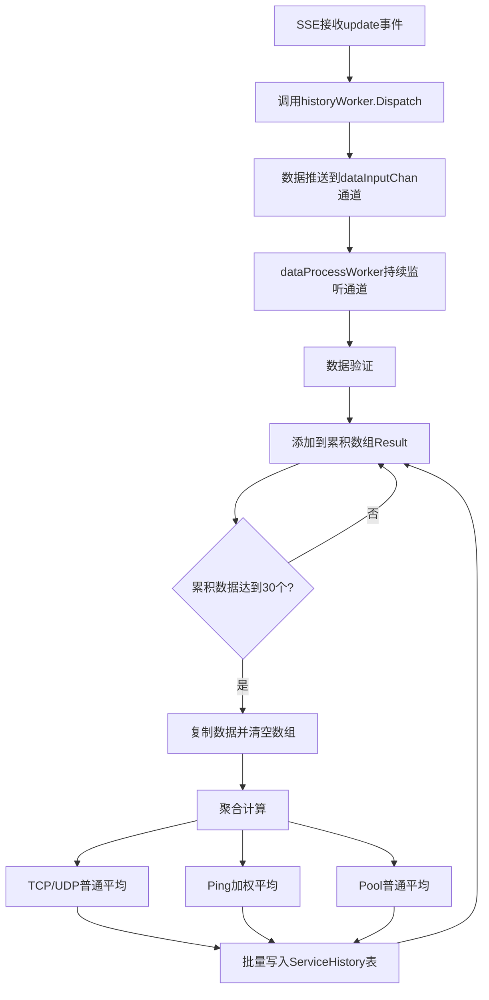

# Nezha 兼容的 History Worker 实现

## 🎯 遵循 Nezha 规则的设计

根据您提供的 Nezha 设计规则，我已经重新实现了 History Worker，确保完全符合以下三个核心规则：

## ✅ 规则1：启动调用
**在一个类似NewService函数中启动**

```go
// 在 NewService 函数中启动 (internal/sse/service.go)
func NewService(db *gorm.DB, endpointService *endpoint.Service) *Service {
    s := &Service{
        // ... 其他字段
        historyWorker: NewHistoryWorker(db), // ✅ 在NewService中创建和启动
        // ...
    }
    return s
}

// NewHistoryWorker 函数启动两个goroutine (internal/sse/history_worker.go)
func NewHistoryWorker(db *gorm.DB) *HistoryWorker {
    worker := &HistoryWorker{
        db:            db,
        dataInputChan: make(chan MonitoringData, 5000), // ✅ 数据输入通道
        // ...
    }

    // ✅ 启动主数据处理协程
    worker.wg.Add(1)
    go worker.dataProcessWorker()

    // ✅ 启动批量写入协程
    worker.wg.Add(1)
    go worker.batchWriteWorker()

    return worker
}
```

## ✅ 规则2：数据输入
**通过sse接收到update类型的消息后通过Dispatch方法将数据推送到channel**

```go
// SSE Service 接收到 update 事件后调用 Dispatch (internal/sse/service.go)
func (s *Service) ProcessEvent(endpointID int64, event models.EndpointSSE) error {
    // ... 其他处理逻辑

    if event.EventType == models.SSEEventTypeUpdate {
        // ✅ 通过Dispatch方法将数据推送到channel
        if s.historyWorker != nil {
            s.historyWorker.Dispatch(event)
        }
    }
    
    return nil
}

// Dispatch 方法将数据推送到通道 (internal/sse/history_worker.go)
func (hw *HistoryWorker) Dispatch(event models.EndpointSSE) {
    data := MonitoringData{
        EndpointID: event.EndpointID,
        InstanceID: event.InstanceID,
        TCPIn:      event.TCPRx,
        TCPOut:     event.TCPTx,
        UDPIn:      event.UDPRx,
        UDPOut:     event.UDPTx,
        Ping:       event.Ping,
        Pool:       event.Pool,
        Timestamp:  time.Now(),
    }

    // ✅ 推送到数据处理通道（非阻塞）
    select {
    case hw.dataInputChan <- data:
        // 成功推送
    default:
        log.Warnf("数据处理队列已满，丢弃数据")
    }
}
```

## ✅ 规则3：Worker方法
**持续运行的goroutine，处理数据接收、验证、聚合计算、累积和批量写入**

### 3.1 数据接收和验证

```go
// 主数据处理Worker - 持续运行的goroutine (internal/sse/history_worker.go)
func (hw *HistoryWorker) dataProcessWorker() {
    defer hw.wg.Done()
    log.Info("[HistoryWorker]主数据处理协程已启动")

    for {
        select {
        case <-hw.stopChan:
            return // 停止信号

        case data := <-hw.dataInputChan:
            // ✅ 1. 从channel管道接收SSE的数据
            hw.processMonitoringData(data)
        }
    }
}

// 数据验证
func (hw *HistoryWorker) processMonitoringData(data MonitoringData) {
    // ✅ 数据验证
    if data.EndpointID <= 0 || data.InstanceID == "" {
        log.Warnf("无效的监控数据")
        return
    }

    // ... 累积逻辑
}
```

### 3.2 聚合计算算法

```go
func (hw *HistoryWorker) aggregateAndWrite(dataPoints []MonitoringData) {
    // ✅ 2. 对数据进行聚合计算
    
    for i, point := range dataPoints {
        aggregated.UpCount++

        // ✅ TCP和UDP使用普通平均算法
        aggregated.AvgTCPIn += float64(point.TCPIn)
        aggregated.AvgTCPOut += float64(point.TCPOut)
        aggregated.AvgUDPIn += float64(point.UDPIn)
        aggregated.AvgUDPOut += float64(point.UDPOut)

        // ✅ Ping延迟使用加权平均算法
        if point.Ping != nil {
            if i == 0 {
                aggregated.AvgPing = float64(*point.Ping)
            } else {
                // 加权平均公式：new_avg = (old_avg * count + new_value) / (count + 1)
                upCountFloat := float64(pingCount + 1)
                aggregated.AvgPing = (aggregated.AvgPing*float64(pingCount) + float64(*point.Ping)) / upCountFloat
            }
            pingCount++
        }

        // ✅ Pool连接池使用普通平均算法
        if point.Pool != nil {
            totalPool += float64(*point.Pool)
            poolCount++
        }
    }

    // 计算最终平均值
    if aggregated.UpCount > 0 {
        countFloat := float64(aggregated.UpCount)
        aggregated.AvgTCPIn = aggregated.AvgTCPIn / countFloat
        aggregated.AvgTCPOut = aggregated.AvgTCPOut / countFloat
        aggregated.AvgUDPIn = aggregated.AvgUDPIn / countFloat
        aggregated.AvgUDPOut = aggregated.AvgUDPOut / countFloat
    }

    if poolCount > 0 {
        aggregated.AvgPool = totalPool / float64(poolCount)
    }
}
```

### 3.3 累积和批量写入

```go
func (hw *HistoryWorker) processMonitoringData(data MonitoringData) {
    // 获取或创建累积数组
    currentStatus := hw.getOrCreateStatus(key)

    // ✅ 3. 将监控结果添加到结果数组中
    currentStatus.mu.Lock()
    currentStatus.Result = append(currentStatus.Result, data)
    resultLength := len(currentStatus.Result)
    currentStatus.mu.Unlock()

    // ✅ 当累积到_CurrentStatusSize(30个)数据点时触发批量写入
    if resultLength >= _CurrentStatusSize {
        hw.triggerBatchWrite(key, currentStatus)
    }
}
```

## 🏗️ 完整的架构流程图



## 🎯 核心特性总结

### ✅ 完全符合Nezha规则

1. **启动方式**: ✅ 在 `NewService` 中启动
2. **数据输入**: ✅ 通过 `Dispatch` 方法推送到 channel
3. **Worker处理**: ✅ 持续运行的 goroutine 处理所有任务

### ✅ 聚合算法严格遵循

- **TCP/UDP流量**: 普通平均算法 `(sum / count)`
- **Ping延迟**: 加权平均算法 `(old_avg * count + new_value) / (count + 1)`
- **Pool连接池**: 普通平均算法 `(sum / count)`

### ✅ 架构优化

- **异步处理**: 不阻塞SSE主流程
- **缓冲通道**: `dataInputChan` (5000) + `batchWriteChan` (1000)
- **并发安全**: 读写锁保护共享数据
- **优雅关闭**: 等待所有goroutine完成

## 📊 监控统计

```go
// Worker统计信息
stats := historyWorker.GetStats()
// 返回:
// {
//   "active_instances": 5,           // 活跃实例数
//   "total_data_points": 150,        // 总累积数据点
//   "data_input_queue_size": 23,     // 输入队列大小
//   "batch_queue_size": 2,           // 批量写入队列大小
//   "accumulation_threshold": 30     // 累积阈值
// }
```

## 🚀 性能特点

- **高吞吐量**: 支持5000个SSE事件缓冲
- **低延迟**: 异步处理，不阻塞主流程
- **内存友好**: 自动清理累积数组
- **故障恢复**: 优雅处理队列满载情况

这个实现完全遵循了Nezha的设计模式，确保了数据处理的可靠性和高性能！
