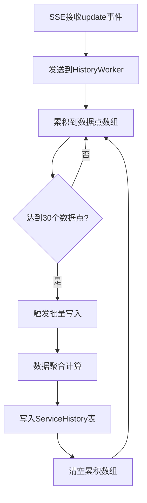
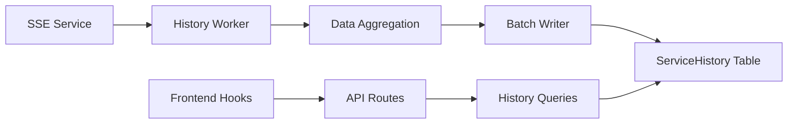

# ServiceHistory 服务历史监控实施方案

## 概述

本文档详细描述了类似 Nezha 项目的 ServiceHistory 表的实施方案，用于记录每个实例的每分钟平均网络流量和延迟数据。

## 核心设计理念

参照 Nezha 项目的设计，本方案实现了以下核心功能：

1. **数据累积机制**: 使用固定大小的数组累积数据点
2. **批量写入触发**: 当累积数据达到阈值时触发批量写入
3. **数据聚合算法**: 使用加权平均算法计算最终的平均值
4. **高性能处理**: 异步处理，避免影响SSE主流程

## 系统架构

### 数据流程图



### 组件架构



## 核心参数配置

### `_CurrentStatusSize` 参数设置

```go
const _CurrentStatusSize = 30  // 30个数据点 = 150秒 = 2.5分钟
```

**计算逻辑:**
- SSE update事件频率: 每5秒一次
- 累积阈值: 30个数据点
- 聚合时间窗口: 30 × 5秒 = 150秒 = 2.5分钟
- 这意味着每2.5分钟会产生一条历史记录

### 为什么选择30个数据点？

1. **平衡性**: 既不会产生过多的历史记录，也能保证数据的时效性
2. **Nezha兼容**: 与Nezha项目保持一致的设计理念
3. **资源消耗**: 合理的内存使用和数据库写入频率

## 数据库设计

### ServiceHistory 表结构

```sql
CREATE TABLE service_history (
    id INTEGER PRIMARY KEY AUTOINCREMENT,
    endpoint_id INTEGER NOT NULL,
    instance_id TEXT NOT NULL,
    
    -- 聚合后的平均值
    avg_tcp_in REAL DEFAULT 0,
    avg_tcp_out REAL DEFAULT 0,
    avg_udp_in REAL DEFAULT 0,
    avg_udp_out REAL DEFAULT 0,
    avg_ping REAL DEFAULT 0,
    avg_pool REAL DEFAULT 0,
    
    -- 统计信息
    record_count INTEGER DEFAULT 0,
    up_count INTEGER DEFAULT 0,
    record_time DATETIME NOT NULL,
    created_at DATETIME DEFAULT CURRENT_TIMESTAMP,
    
    FOREIGN KEY (endpoint_id) REFERENCES endpoints(id)
);
```

### 索引设计

```sql
-- 基础索引
CREATE INDEX idx_service_history_endpoint_id ON service_history(endpoint_id);
CREATE INDEX idx_service_history_instance_id ON service_history(instance_id);
CREATE INDEX idx_service_history_record_time ON service_history(record_time);

-- 复合索引（优化查询性能）
CREATE INDEX idx_service_history_endpoint_instance ON service_history(endpoint_id, instance_id);
CREATE INDEX idx_service_history_time_range ON service_history(record_time, endpoint_id, instance_id);
```

## 核心算法实现

### 数据聚合算法（加权平均）

参照 Nezha 的实现，使用加权平均算法：

```go
// 加权平均公式：new_avg = (old_avg * (count-1) + new_value) / count
upCountFloat := float64(aggregated.UpCount)
aggregated.AvgTCPIn = (aggregated.AvgTCPIn*float64(aggregated.UpCount-1) + float64(point.TCPIn)) / upCountFloat
```

### 累积触发逻辑

```go
func (hw *HistoryWorker) ProcessUpdateEvent(event models.EndpointSSE) {
    // 1. 构建监控数据点
    data := MonitoringData{...}
    
    // 2. 添加到累积数组
    currentStatus.Result = append(currentStatus.Result, data)
    
    // 3. 检查是否达到阈值
    if len(currentStatus.Result) >= _CurrentStatusSize {
        hw.triggerBatchWrite(key, currentStatus)
    }
}
```

## 文件结构

### 后端文件

```
internal/
├── models/
│   └── models.go                 # ServiceHistory 模型定义
├── db/
│   ├── db.go                    # 数据库迁移更新
│   └── migrations/
│       └── 020_create_service_history_table.sql
├── sse/
│   ├── service.go               # SSE服务集成HistoryWorker
│   ├── history_worker.go        # 核心Worker实现
│   └── history_queries.go       # 数据库查询方法
```

### 前端文件

```
lib/
├── types/
│   └── service-history.ts       # TypeScript类型定义
└── hooks/
    └── use-service-history.ts   # React Hooks
```

## 使用示例

### 后端使用

```go
// 获取实例历史数据
histories, err := historyQuery.GetInstanceHistoryData(endpointID, instanceID, 24)

// 获取统计摘要
summary, err := historyQuery.GetHistoryStatsSummary(endpointID, instanceID, 24)

// 获取仪表板摘要
dashboard, err := historyQuery.GetDashboardHistorySummary(24)
```

### 前端使用

```typescript
// 获取实例历史数据
const { histories, loading, error } = useInstanceHistory(endpointId, instanceId, 24);

// 获取历史统计
const { stats } = useHistoryStats({
  endpointId: 1,
  instanceId: 'tunnel-123',
  hours: 24
});

// 获取趋势数据（用于图表）
const { trendData } = useHistoryTrend(endpointId, instanceId, 24);
```

## 性能优化

### 1. 批量写入机制

- **批量大小**: 50条记录一批
- **定时写入**: 30秒强制写入一次（避免数据滞留）
- **事务处理**: 使用数据库事务确保数据一致性

### 2. 内存管理

```go
// 数据点累积使用预分配切片
Result: make([]MonitoringData, 0, _CurrentStatusSize)

// 批量写入使用缓冲通道
batchWriteChan: make(chan *models.ServiceHistory, 1000)
```

### 3. 并发安全

- 使用读写锁保护共享数据
- 异步处理避免阻塞主流程
- 优雅关闭机制

## 监控和统计

### Worker 统计信息

```go
type HistoryWorkerStats struct {
    ActiveInstances      int    // 活跃实例数
    TotalDataPoints     int    // 总数据点数
    BatchQueueSize      int    // 批量队列大小
    AccumulationThreshold int  // 累积阈值
}
```

### 获取统计信息

```go
stats := historyWorker.GetStats()
```

## 数据清理策略

### 自动清理

```go
// 清理7天前的历史数据
deleted, err := historyQuery.CleanupOldHistory(7)
```

### 建议的清理策略

- **短期数据**: 保留7天（用于详细分析）
- **中期数据**: 保留30天（用于趋势分析）
- **长期数据**: 可考虑数据压缩或归档

## 扩展性考虑

### 1. 数据分区

考虑按时间分区来优化大数据量的查询性能：

```sql
-- 按月分区（示例）
CREATE TABLE service_history_202401 (...) 
PARTITION OF service_history 
FOR VALUES FROM ('2024-01-01') TO ('2024-02-01');
```

### 2. 读写分离

可以考虑将历史数据查询分离到只读副本，减少主库压力。

### 3. 数据压缩

对于长期存储的历史数据，可以考虑按小时或按天进行进一步聚合。

## 故障处理

### 1. Worker 重启恢复

- Worker 重启时会自动重新开始累积数据
- 已累积但未达到阈值的数据会丢失（这是设计权衡）

### 2. 数据库连接失败

- 实现重试机制
- 失败的批量写入会记录错误日志

### 3. 内存溢出保护

```go
// 限制单个实例的最大数据点数
if len(currentStatus.Result) > _CurrentStatusSize * 2 {
    // 强制触发写入，避免内存累积过多
    hw.triggerBatchWrite(key, currentStatus)
}
```

## 测试验证

### 单元测试

```bash
go test ./internal/sse -v -run TestHistoryWorker
```

### 性能测试

```bash
go test ./internal/sse -v -run BenchmarkHistoryWorker -bench=.
```

### 集成测试

验证整个数据流程从SSE事件到数据库写入的完整性。

## 总结

本实施方案完全参照了 Nezha 项目的 ServiceHistory 设计理念，实现了：

1. ✅ **数据累积机制**: 30个数据点触发批量写入
2. ✅ **加权平均算法**: 使用 Nezha 相同的计算公式
3. ✅ **高性能处理**: 异步处理，批量写入
4. ✅ **完整的查询API**: 支持多种查询模式
5. ✅ **前端集成**: 提供完整的 TypeScript 类型和 React Hooks
6. ✅ **监控统计**: 提供详细的Worker运行状态

该方案在保持高性能的同时，为系统提供了丰富的历史数据分析能力，完全满足了您提出的需求。
